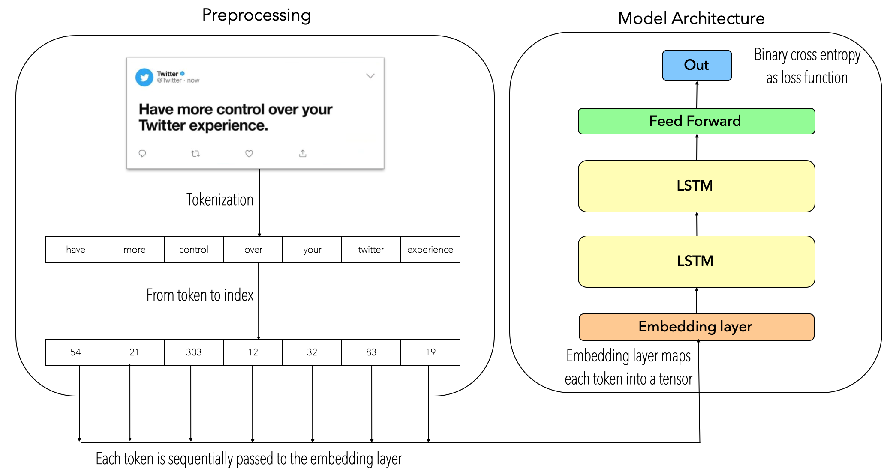
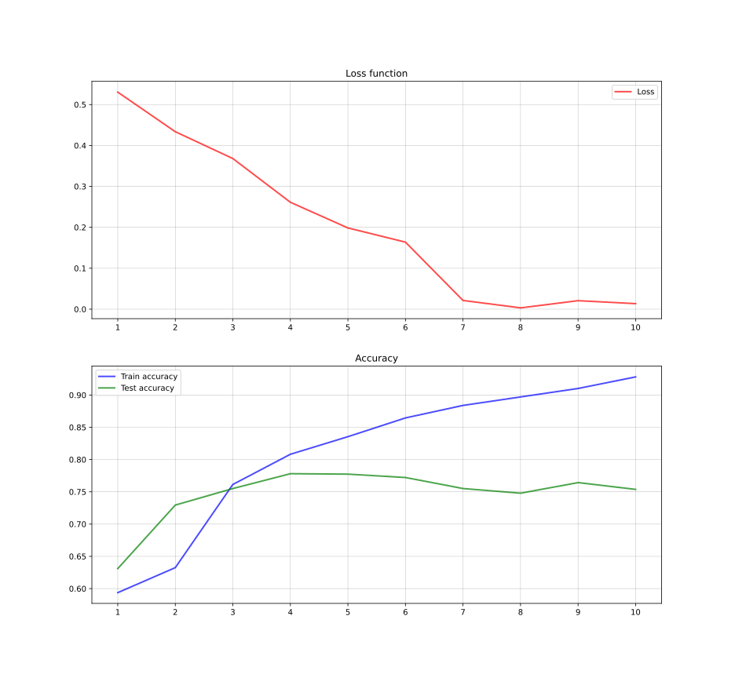

# Text Classification through LSTMs

The aim of this repository is to show a baseline model for text classification by implementing a LSTM-based model coded in PyTorch. In order to provide a better understanding of the model, it will be used a Tweets dataset provided by <a href="https://www.kaggle.com/c/nlp-getting-started">Kaggle</a>

If you want to delve into the details regarding how the text was pre-processed, how the sequences were generated, how the neural network was built from the LSTMCells and how the model was trained, I highly recommend reading the blog:
<a href="https://towardsdatascience.com/text-classification-with-pytorch-7111dae111a6">Text Classification with PyTorch</a>

## 1. Data
As it was mentioned above, the implemented dataset is about Tweets regarding fake news. The ``raw``dataset contains some unnecessary columns which are going to be removed in the preprocessing step, in the end, we will be working with a dataset with a head such as this: 

|id| text | target |
| ------------- | ------------- | ------------- |
| 1  | Our Deeds are the Reason of this #earthquake May ALLAH Forgive us all  |1  |
| 2  | SOOOO PUMPED FOR ABLAZE ???? @southridgelife  | 0  |
| 3  | INEC Office in Abia Set Ablaze - http://t.co/3ImaomknnA  | 1 |
| 4  | Building the perfect tracklist to life leave the streets ablaze  | 0  |

This raw dataset can be found in ``data/tweets.csv``. 

## 2. The model
As it was already commented, the aim of this repository is to provide a base line model for text classfication. In this sense, the model is based on a two-stacked LSTM layers followed by two linear layers. The dataset is preprocessed through a tokens-based technique, then tokens are associated to an embedding layer. The following image describes the pipeline of the model.
<p align="center">

</p>

## 3. Dependencies
This model was developed under these specified versions:
```
torch==1.0.1.post2
torchtext==0.6.0
tensorflow==1.12.0
Keras==2.0.0
numpy==1.15.4
pandas==1.0.3
```
## 4. How to use it
The model can be executed easily by typing:
```
python main.py
```
You can define some hyperparameters manually, such as:
```
 main.py [-h] [--epochs EPOCHS] [--learning_rate LEARNING_RATE]
         [--hidden_dim HIDDEN_DIM] [--lstm_layers LSTM_LAYERS]
         [--batch_size BATCH_SIZE] [--test_size TEST_SIZE]
         [--max_len MAX_LEN] [--max_words MAX_WORDS]
```

## 5. Demo
The follwowing configuration was implemented in order to achieve the best results
```
python -B main.py --epochs 10 --learning_rate 0.01 --hidden_dim 128 --lstm_layers 2 --batch_size 64
```
by getting the following output:
```
Epoch: 1, loss: 0.53032, Train accuracy: 0.59376, Test accuracy: 0.63099
Epoch: 2, loss: 0.43361, Train accuracy: 0.63251, Test accuracy: 0.72948
Epoch: 3, loss: 0.36803, Train accuracy: 0.76141, Test accuracy: 0.75509
Epoch: 4, loss: 0.26117, Train accuracy: 0.80821, Test accuracy: 0.77807
Epoch: 5, loss: 0.19844, Train accuracy: 0.83547, Test accuracy: 0.77741
Epoch: 6, loss: 0.16377, Train accuracy: 0.86453, Test accuracy: 0.77216
Epoch: 7, loss: 0.02130, Train accuracy: 0.88391, Test accuracy: 0.75509
Epoch: 8, loss: 0.00315, Train accuracy: 0.89704, Test accuracy: 0.74787
Epoch: 9, loss: 0.02075, Train accuracy: 0.91018, Test accuracy: 0.76428
Epoch: 10, loss: 0.01348, Train accuracy: 0.92808, Test accuracy: 0.75378
```
So the learning curves will look like:
<p align="center">

</p>

## 6. Future work
As it was mentioned, the aim of this repository is to provdie a base line for the text classification task. It's important to mention that, the problem of text classifications goes beyond than a two-stacked LSTM architecture where texts are preprocessed under tokens-based methodology. Recent works have shown impressive results by implemeting transformers based architectures (e.g. <a href="https://jalammar.github.io/a-visual-guide-to-using-bert-for-the-first-time/"> BERT</a>). Nevertheless, by following this thread, this proposed model can be improved by removing the tokens-based methodology and implementing a word embeddings based model instead (e.g. <a href="https://radimrehurek.com/gensim/models/word2vec.html">word2vec-gensim</a>). Likewise, bi-directional LSTMs can be applied in order to catch more context (in a forward and backward way). 

<i>The question remains open: how to learn semantics? what is semantics? would DL-based models be capable to learn semantics?</i>